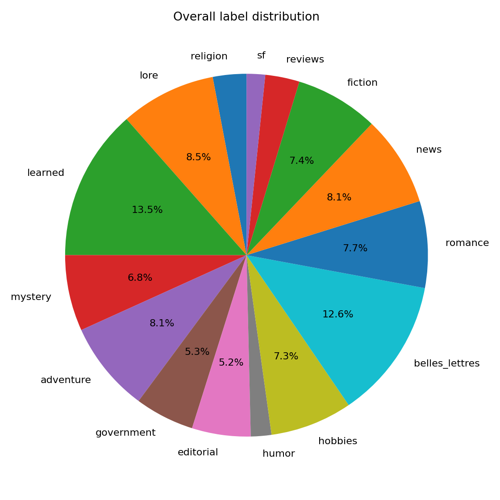
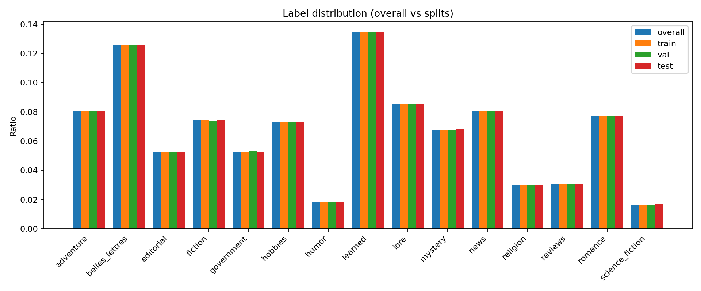
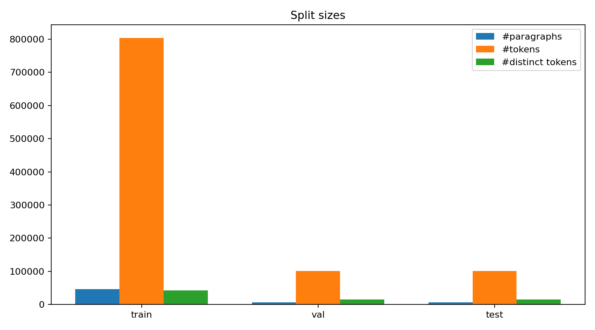
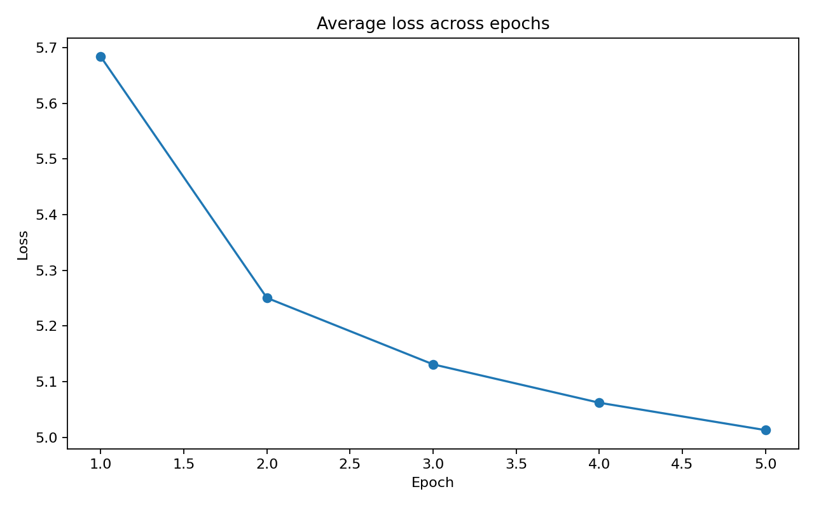
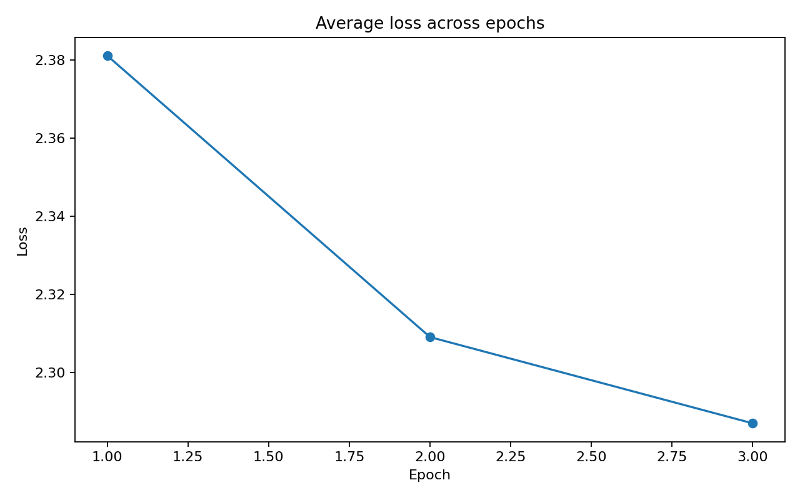

# Overview

This project uses the Brown Corpus (downloaded via `kagglehub`) to train word2vec embeddings with two training variants: Continuous Bag of Words (CBOW) and Skip-Gram with Negative Sampling (SGNS).

## Environment Setup and Running

To set up the environment, we recommend using `uv` with the following commands from the project directory:

```bash
uv venv
source .venv/bin/activate
uv pip install -r requirements.txt
```

## Data

The Brown Corpus contains text paragraphs derived from the following categories:



Class balance visualization:
When splitting the dataset into train/val/test, labels are balanced across all three splits.



## Tokens

To speed up local training, we set an upper vocabulary size limit of 3000 (most frequent tokens) and map the rest to the unknown token `<UNK>`.

| Item                             | Value   |
| -------------------------------- | ------- |
| Vocabulary size used in training | 3000    |
| Unknown token                    | `<UNK>` |

Token diagnostics:


## Reproducing the plots

To reproduce the dataset plots, run:

```bash
uv run python -m dataset.visualise
```

# Model

Both models use an 80/10/10 train/val/test split.
Split plot:



## Continuous Bag of Words (CBOW)

CBOW predicts the center word from surrounding context words.
Training uses cross-entropy over the softmax output.

### Command

```bash
uv run python -m src.main --train cbow
```

### Loss plot



### Validation/Test mini table

| Metric      | Value  |
| ----------- | ------ |
| `val_loss`  | 4.7184 |
| `test_loss` | 4.7098 |

### Testing embeddings in practice

Nearest neighbors for 'man':

- girl: 0.7524
- woman: 0.7431
- child: 0.7162
- writer: 0.6557
- boy: 0.6496

Nearest neighbors for 'time':

- moment: 0.6865
- argument: 0.6683
- night: 0.6631
- day: 0.6298
- month: 0.6238

Nearest neighbors for 'year':

- week: 0.7347
- month: 0.6719
- season: 0.6552
- minute: 0.6450
- night: 0.6402

Nearest neighbors for 'good':

- bad: 0.5682
- strong: 0.5368
- great: 0.5322
- big: 0.5069
- simple: 0.4857

## Skip-Gram with Negative Sampling (SGNS)

SGNS predicts context words from a center word using sampled negatives.
Training uses logistic loss for positive and negative pairs.

### Command

```bash
uv run python -m src.main --train sgns
```

### Loss plot



### Validation/Test mini table

| Metric      | Value  |
| ----------- | ------ |
| `val_loss`  | 2.3074 |
| `test_loss` | 2.3069 |

### Testing embeddings in practice

Nearest neighbors for 'man':

- woman: 0.8363
- girl: 0.8311
- boy: 0.7793
- lady: 0.7705
- fat: 0.7645

Nearest neighbors for 'time':

- night: 0.7550
- moment: 0.7536
- instant: 0.7328
- schedule: 0.7212
- conclusion: 0.7016

Nearest neighbors for 'year':

- month: 0.8845
- week: 0.8312
- months: 0.7770
- day: 0.7705
- weeks: 0.7605

Nearest neighbors for 'good':

- bad: 0.8921
- fine: 0.8431
- nice: 0.8255
- little: 0.8214
- definite: 0.8045

# Grid Search

To perform a grid search on hyperparameters, run:

```bash
uv run python -m src.main --grid-search cbow
uv run python -m src.main --grid-search sgns
```

To assess the best hyperparameters, check the printed JSON summary (`best_by_val`) after each grid-search run.

### Continuous Bag of Words (CBOW): best hyperparameters

- learning rate: `0.1`
- window size: `2`

### Skip-Gram with Negative Sampling (SGNS): best hyperparameters

- learning rate: `0.05`
- negative samples: `3`
- window size: `2`

```bash
uv run python -m src.main --grid-search sgns
```
