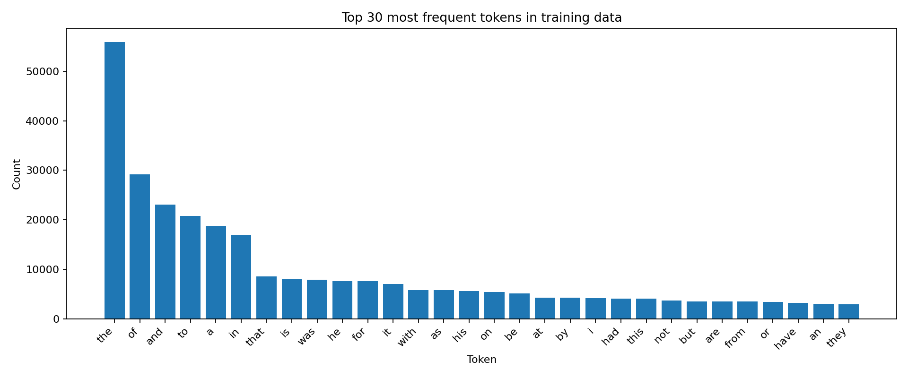
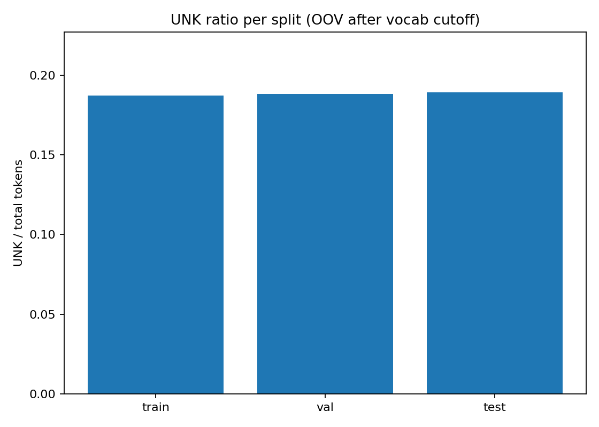

# Data

## Overview

This project uses the Brown Corpus (downloaded via `kagglehub`) to train word embeddings.
Class balance visualization:


## Tokens

| Item                             | Value   |
| -------------------------------- | ------- |
| Vocabulary size used in training | 3000    |
| Unknown token                    | `<UNK>` |

Token diagnostics:




# Model

Both models use an 80/10/10 train/val/test split.
Split plot:


## Continuous Bag of Words (CBOW)

CBOW predicts the center word from surrounding context words.
Training uses cross-entropy over the softmax output.

### Command

```bash
cd src
uv run python main.py --train cbow
```

### Loss plot


### Validation/Test mini table

| Metric      | Value             |
| ----------- | ----------------- |
| `val_loss`  | from training log |
| `test_loss` | from training log |

## Skip-Gram with Negative Sampling (SGNS)

SGNS predicts context words from a center word using sampled negatives.
Training uses logistic loss for positive and negative pairs.

### Command

```bash
cd src
uv run python main.py --train sgns
```

### Loss plot


### Validation/Test mini table

| Metric      | Value             |
| ----------- | ----------------- |
| `val_loss`  | from training log |
| `test_loss` | from training log |
